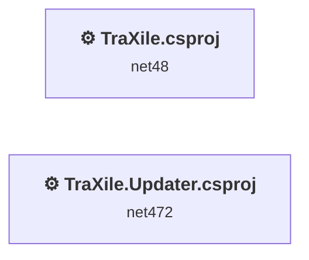
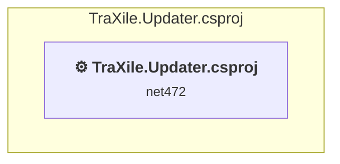
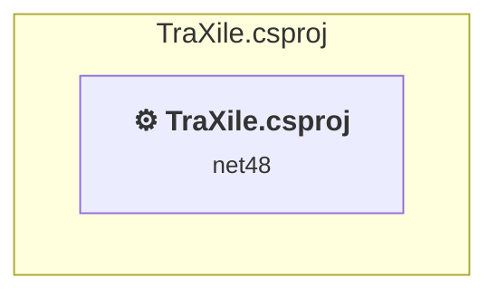

# Projects and dependencies analysis

This document provides a comprehensive overview of the projects and their dependencies in the context of upgrading to .NETCoreApp,Version=v10.0.

## Table of Contents

- [Executive Summary](#executive-Summary)
  - [Highlevel Metrics](#highlevel-metrics)
  - [Projects Compatibility](#projects-compatibility)
  - [Package Compatibility](#package-compatibility)
  - [API Compatibility](#api-compatibility)
- [Aggregate NuGet packages details](#aggregate-nuget-packages-details)
- [Top API Migration Challenges](#top-api-migration-challenges)
  - [Technologies and Features](#technologies-and-features)
  - [Most Frequent API Issues](#most-frequent-api-issues)
- [Projects Relationship Graph](#projects-relationship-graph)
- [Project Details](#project-details)

  - [TraXile.Updater\TraXile.Updater.csproj](#traxileupdatertraxileupdatercsproj)
  - [TraXile\TraXile.csproj](#traxiletraxilecsproj)

## Executive Summary

### Highlevel Metrics

| Metric | Count | Status |
| :--- | :---: | :--- |
| Total Projects | 2 | All require upgrade |
| Total NuGet Packages | 35 | 12 need upgrade |
| Total Code Files | 68 |  |
| Total Code Files with Incidents | 48 |  |
| Total Lines of Code | 25114 |  |
| Total Number of Issues | 17371 |  |
| Estimated LOC to modify | 17342+ | at least 69,1% of codebase |

### Projects Compatibility

| Project | Target Framework | Difficulty | Package Issues | API Issues | Est. LOC Impact | Description |
| :--- | :---: | :---: | :---: | :---: | :---: | :--- |
| [TraXile.Updater\TraXile.Updater.csproj](#traxileupdatertraxileupdatercsproj) | net472 | 🟡 Medium | 4 | 81 | 81+ | ClassicWinForms, Sdk Style = False |
| [TraXile\TraXile.csproj](#traxiletraxilecsproj) | net48 | 🟡 Medium | 21 | 17261 | 17261+ | ClassicWinForms, Sdk Style = False |

### Package Compatibility

| Status | Count | Percentage |
| :--- | :---: | :---: |
| ✅ Compatible | 23 | 65,7% |
| ⚠️ Incompatible | 4 | 11,4% |
| 🔄 Upgrade Recommended | 8 | 22,9% |
| ***Total NuGet Packages*** | ***35*** | ***100%*** |

### API Compatibility

| Category | Count | Impact |
| :--- | :---: | :--- |
| 🔴 Binary Incompatible | 13947 | High - Require code changes |
| 🟡 Source Incompatible | 3388 | Medium - Needs re-compilation and potential conflicting API error fixing |
| 🔵 Behavioral change | 7 | Low - Behavioral changes that may require testing at runtime |
| ✅ Compatible | 33576 |  |
| ***Total APIs Analyzed*** | ***50918*** |  |

## Aggregate NuGet packages details

| Package | Current Version | Suggested Version | Projects | Description |
| :--- | :---: | :---: | :--- | :--- |
| Json.Net | 1.0.33 |  | [TraXile.csproj](#traxiletraxilecsproj) | ✅Compatible |
| KVLib | 1.0.0.0 |  | [TraXile.csproj](#traxiletraxilecsproj) | ⚠️Das NuGet-Paket ist nicht kompatibel |
| log4net | 3.1.0 |  | [TraXile.csproj](#traxiletraxilecsproj) [TraXile.Updater.csproj](#traxileupdatertraxileupdatercsproj) | ✅Compatible |
| MaterialSkin.2 | 2.3.1 |  | [TraXile.csproj](#traxiletraxilecsproj) | ⚠️Das NuGet-Paket ist nicht kompatibel |
| Microsoft.Data.Sqlite | 5.0.7 | 10.0.1 | [TraXile.csproj](#traxiletraxilecsproj) | Ein NuGet-Paketupgrade wird empfohlen |
| Microsoft.Data.Sqlite.Core | 5.0.7 | 10.0.1 | [TraXile.csproj](#traxiletraxilecsproj) | Ein NuGet-Paketupgrade wird empfohlen |
| Microsoft.Win32.Registry | 4.7.0 |  | [TraXile.csproj](#traxiletraxilecsproj) | Die Funktionalität des NuGet-Pakets ist im Frameworkverweis enthalten |
| NAudio | 2.2.1 |  | [TraXile.csproj](#traxiletraxilecsproj) | ✅Compatible |
| NAudio.Asio | 2.2.1 |  | [TraXile.csproj](#traxiletraxilecsproj) | ✅Compatible |
| NAudio.Core | 2.2.1 |  | [TraXile.csproj](#traxiletraxilecsproj) | ✅Compatible |
| NAudio.Midi | 2.2.1 |  | [TraXile.csproj](#traxiletraxilecsproj) | ✅Compatible |
| NAudio.Wasapi | 2.2.1 |  | [TraXile.csproj](#traxiletraxilecsproj) | ✅Compatible |
| NAudio.WinForms | 2.2.1 |  | [TraXile.csproj](#traxiletraxilecsproj) | ✅Compatible |
| NAudio.WinMM | 2.2.1 |  | [TraXile.csproj](#traxiletraxilecsproj) | ✅Compatible |
| Newtonsoft.Json | 13.0.1 | 13.0.4 | [TraXile.csproj](#traxiletraxilecsproj) | Ein NuGet-Paketupgrade wird empfohlen |
| Octokit | 0.50.0 |  | [TraXile.Updater.csproj](#traxileupdatertraxileupdatercsproj) | ✅Compatible |
| Octokit.Reactive | 0.47.0 |  | [TraXile.Updater.csproj](#traxileupdatertraxileupdatercsproj) | ✅Compatible |
| Sprache | 1.10.0.35 | 2.3.1 | [TraXile.csproj](#traxiletraxilecsproj) | ⚠️Das NuGet-Paket ist nicht kompatibel |
| SQLitePCLRaw.bundle_e_sqlite3 | 2.0.4 |  | [TraXile.csproj](#traxiletraxilecsproj) | ✅Compatible |
| SQLitePCLRaw.core | 2.0.4 |  | [TraXile.csproj](#traxiletraxilecsproj) | ✅Compatible |
| SQLitePCLRaw.lib.e_sqlite3 | 2.0.4 |  | [TraXile.csproj](#traxiletraxilecsproj) | ⚠️Das NuGet-Paket ist veraltet |
| SQLitePCLRaw.provider.dynamic_cdecl | 2.0.4 |  | [TraXile.csproj](#traxiletraxilecsproj) | ✅Compatible |
| System.Buffers | 4.4.0 |  | [TraXile.csproj](#traxiletraxilecsproj) | Die Funktionalität des NuGet-Pakets ist im Frameworkverweis enthalten |
| System.Configuration.ConfigurationManager | 5.0.0 | 10.0.1 | [TraXile.csproj](#traxiletraxilecsproj) | Ein NuGet-Paketupgrade wird empfohlen |
| System.IO.Compression.ZipFile | 4.3.0 |  | [TraXile.Updater.csproj](#traxileupdatertraxileupdatercsproj) | Die Funktionalität des NuGet-Pakets ist im Frameworkverweis enthalten |
| System.Memory | 4.5.3 |  | [TraXile.csproj](#traxiletraxilecsproj) | Die Funktionalität des NuGet-Pakets ist im Frameworkverweis enthalten |
| System.Numerics.Vectors | 4.4.0 |  | [TraXile.csproj](#traxiletraxilecsproj) | Die Funktionalität des NuGet-Pakets ist im Frameworkverweis enthalten |
| System.Reactive | 4.4.1 |  | [TraXile.Updater.csproj](#traxileupdatertraxileupdatercsproj) | ✅Compatible |
| System.Runtime.CompilerServices.Unsafe | 4.5.2 | 6.1.2 | [TraXile.csproj](#traxiletraxilecsproj) | Ein NuGet-Paketupgrade wird empfohlen |
| System.Runtime.CompilerServices.Unsafe | 4.5.3 | 6.1.2 | [TraXile.Updater.csproj](#traxileupdatertraxileupdatercsproj) | Ein NuGet-Paketupgrade wird empfohlen |
| System.Security.AccessControl | 5.0.0 | 6.0.1 | [TraXile.csproj](#traxiletraxilecsproj) | Ein NuGet-Paketupgrade wird empfohlen |
| System.Security.Permissions | 5.0.0 | 10.0.1 | [TraXile.csproj](#traxiletraxilecsproj) | Ein NuGet-Paketupgrade wird empfohlen |
| System.Security.Principal.Windows | 5.0.0 |  | [TraXile.csproj](#traxiletraxilecsproj) | Die Funktionalität des NuGet-Pakets ist im Frameworkverweis enthalten |
| System.Threading.Tasks.Extensions | 4.5.4 |  | [TraXile.Updater.csproj](#traxileupdatertraxileupdatercsproj) | Die Funktionalität des NuGet-Pakets ist im Frameworkverweis enthalten |
| System.ValueTuple | 4.5.0 |  | [TraXile.Updater.csproj](#traxileupdatertraxileupdatercsproj) | Die Funktionalität des NuGet-Pakets ist im Frameworkverweis enthalten |

## Top API Migration Challenges

### Technologies and Features

| Technology | Issues | Percentage | Migration Path |
| :--- | :---: | :---: | :--- |
| Windows Forms | 15111 | 87,1% | Windows Forms APIs for building Windows desktop applications with traditional Forms-based UI that are available in .NET on Windows. Enable Windows Desktop support: Option 1 (Recommended): Target net9.0-windows; Option 2: Add <UseWindowsDesktop>true</UseWindowsDesktop>; Option 3 (Legacy): Use Microsoft.NET.Sdk.WindowsDesktop SDK. |
| GDI+ / System.Drawing | 2190 | 12,6% | System.Drawing APIs for 2D graphics, imaging, and printing that are available via NuGet package System.Drawing.Common. Note: Not recommended for server scenarios due to Windows dependencies; consider cross-platform alternatives like SkiaSharp or ImageSharp for new code. |
| Windows Forms Legacy Controls | 66 | 0,4% | Legacy Windows Forms controls that have been removed from .NET Core/5+ including StatusBar, DataGrid, ContextMenu, MainMenu, MenuItem, and ToolBar. These controls were replaced by more modern alternatives. Use ToolStrip, MenuStrip, ContextMenuStrip, and DataGridView instead. |
| Legacy Configuration System | 6 | 0,0% | Legacy XML-based configuration system (app.config/web.config) that has been replaced by a more flexible configuration model in .NET Core. The old system was rigid and XML-based. Migrate to Microsoft.Extensions.Configuration with JSON/environment variables; use System.Configuration.ConfigurationManager NuGet package as interim bridge if needed. |

### Most Frequent API Issues

| API | Count | Percentage | Category |
| :--- | :---: | :---: | :--- |
| T:System.Windows.Forms.TableLayoutPanel | 753 | 4,3% | Binary Incompatible |
| T:System.Windows.Forms.DockStyle | 489 | 2,8% | Binary Incompatible |
| T:System.Windows.Forms.Label | 470 | 2,7% | Binary Incompatible |
| P:System.Windows.Forms.Control.Name | 463 | 2,7% | Binary Incompatible |
| T:System.Windows.Forms.Padding | 450 | 2,6% | Binary Incompatible |
| P:System.Windows.Forms.Control.Location | 444 | 2,6% | Binary Incompatible |
| T:System.Drawing.Font | 438 | 2,5% | Source Incompatible |
| P:System.Windows.Forms.Control.Size | 422 | 2,4% | Binary Incompatible |
| T:System.Drawing.FontStyle | 418 | 2,4% | Source Incompatible |
| T:System.Drawing.GraphicsUnit | 414 | 2,4% | Source Incompatible |
| P:System.Windows.Forms.Control.TabIndex | 402 | 2,3% | Binary Incompatible |
| T:System.Windows.Forms.SizeType | 348 | 2,0% | Binary Incompatible |
| T:System.Windows.Forms.Control.ControlCollection | 332 | 1,9% | Binary Incompatible |
| P:System.Windows.Forms.Control.Controls | 332 | 1,9% | Binary Incompatible |
| M:System.Windows.Forms.Control.ControlCollection.Add(System.Windows.Forms.Control) | 324 | 1,9% | Binary Incompatible |
| T:System.Windows.Forms.DataVisualization.Charting.Chart | 308 | 1,8% | Source Incompatible |
| T:System.Windows.Forms.PictureBox | 301 | 1,7% | Binary Incompatible |
| P:System.Windows.Forms.Label.Text | 263 | 1,5% | Binary Incompatible |
| P:System.Windows.Forms.Control.Font | 211 | 1,2% | Binary Incompatible |
| T:System.Windows.Forms.TabPage | 193 | 1,1% | Binary Incompatible |
| T:System.Windows.Forms.ToolStripMenuItem | 183 | 1,1% | Binary Incompatible |
| M:System.Windows.Forms.Padding.#ctor(System.Int32) | 181 | 1,0% | Binary Incompatible |
| P:System.Windows.Forms.Label.AutoSize | 173 | 1,0% | Binary Incompatible |
| T:System.Windows.Forms.ColumnHeader | 169 | 1,0% | Binary Incompatible |
| F:System.Drawing.FontStyle.Regular | 167 | 1,0% | Source Incompatible |
| F:System.Drawing.GraphicsUnit.Pixel | 164 | 0,9% | Source Incompatible |
| M:System.Drawing.Font.#ctor(System.String,System.Single,System.Drawing.FontStyle,System.Drawing.GraphicsUnit) | 164 | 0,9% | Source Incompatible |
| P:System.Windows.Forms.Control.Dock | 161 | 0,9% | Binary Incompatible |
| F:System.Windows.Forms.DockStyle.Fill | 157 | 0,9% | Binary Incompatible |
| P:System.Windows.Forms.Control.ForeColor | 153 | 0,9% | Binary Incompatible |
| P:System.Windows.Forms.Control.Margin | 140 | 0,8% | Binary Incompatible |
| M:System.Windows.Forms.Control.SuspendLayout | 140 | 0,8% | Binary Incompatible |
| M:System.Windows.Forms.Control.ResumeLayout(System.Boolean) | 137 | 0,8% | Binary Incompatible |
| T:System.Windows.Forms.RowStyle | 132 | 0,8% | Binary Incompatible |
| T:System.Windows.Forms.TableLayoutRowStyleCollection | 132 | 0,8% | Binary Incompatible |
| P:System.Windows.Forms.TableLayoutPanel.RowStyles | 132 | 0,8% | Binary Incompatible |
| M:System.Windows.Forms.RowStyle.#ctor(System.Windows.Forms.SizeType,System.Single) | 128 | 0,7% | Binary Incompatible |
| M:System.Windows.Forms.TableLayoutRowStyleCollection.Add(System.Windows.Forms.RowStyle) | 128 | 0,7% | Binary Incompatible |
| T:System.Drawing.ContentAlignment | 123 | 0,7% | Source Incompatible |
| F:System.Windows.Forms.SizeType.Absolute | 117 | 0,7% | Binary Incompatible |
| P:System.Windows.Forms.Control.BackColor | 109 | 0,6% | Binary Incompatible |
| T:System.Windows.Forms.TableLayoutControlCollection | 106 | 0,6% | Binary Incompatible |
| P:System.Windows.Forms.TableLayoutPanel.Controls | 106 | 0,6% | Binary Incompatible |
| M:System.Windows.Forms.TableLayoutControlCollection.Add(System.Windows.Forms.Control,System.Int32,System.Int32) | 106 | 0,6% | Binary Incompatible |
| T:System.Windows.Forms.AutoSizeMode | 105 | 0,6% | Binary Incompatible |
| T:System.Windows.Forms.MouseEventHandler | 92 | 0,5% | Binary Incompatible |
| T:System.Windows.Forms.TextBox | 90 | 0,5% | Binary Incompatible |
| T:System.Windows.Forms.DialogResult | 88 | 0,5% | Binary Incompatible |
| T:System.Windows.Forms.LinkLabel | 86 | 0,5% | Binary Incompatible |
| P:System.Windows.Forms.Control.Padding | 85 | 0,5% | Binary Incompatible |

## Projects Relationship Graph

Legend:
📦 SDK-style project
⚙️ Classic project

## Project Details

### TraXile.Updater\TraXile.Updater.csproj

#### Project Info

- **Current Target Framework:** net472
- **Proposed Target Framework:** net10.0-windows
- **SDK-style**: False
- **Project Kind:** ClassicWinForms
- **Dependencies**: 0
- **Dependants**: 0
- **Number of Files**: 11
- **Number of Files with Incidents**: 5
- **Lines of Code**: 354
- **Estimated LOC to modify**: 81+ (at least 22,9% of the project)

#### Dependency Graph

Legend:
📦 SDK-style project
⚙️ Classic project

### API Compatibility

| Category | Count | Impact |
| :--- | :---: | :--- |
| 🔴 Binary Incompatible | 75 | High - Require code changes |
| 🟡 Source Incompatible | 4 | Medium - Needs re-compilation and potential conflicting API error fixing |
| 🔵 Behavioral change | 2 | Low - Behavioral changes that may require testing at runtime |
| ✅ Compatible | 197 |  |
| ***Total APIs Analyzed*** | ***278*** |  |

#### Project Technologies and Features

| Technology | Issues | Percentage | Migration Path |
| :--- | :---: | :---: | :--- |
| Legacy Configuration System | 2 | 2,5% | Legacy XML-based configuration system (app.config/web.config) that has been replaced by a more flexible configuration model in .NET Core. The old system was rigid and XML-based. Migrate to Microsoft.Extensions.Configuration with JSON/environment variables; use System.Configuration.ConfigurationManager NuGet package as interim bridge if needed. |
| GDI+ / System.Drawing | 1 | 1,2% | System.Drawing APIs for 2D graphics, imaging, and printing that are available via NuGet package System.Drawing.Common. Note: Not recommended for server scenarios due to Windows dependencies; consider cross-platform alternatives like SkiaSharp or ImageSharp for new code. |
| Windows Forms | 75 | 92,6% | Windows Forms APIs for building Windows desktop applications with traditional Forms-based UI that are available in .NET on Windows. Enable Windows Desktop support: Option 1 (Recommended): Target net9.0-windows; Option 2: Add <UseWindowsDesktop>true</UseWindowsDesktop>; Option 3 (Legacy): Use Microsoft.NET.Sdk.WindowsDesktop SDK. |

### TraXile\TraXile.csproj

#### Project Info

- **Current Target Framework:** net48
- **Proposed Target Framework:** net10.0-windows
- **SDK-style**: False
- **Project Kind:** ClassicWinForms
- **Dependencies**: 0
- **Dependants**: 0
- **Number of Files**: 98
- **Number of Files with Incidents**: 43
- **Lines of Code**: 24760
- **Estimated LOC to modify**: 17261+ (at least 69,7% of the project)

#### Dependency Graph

Legend:
📦 SDK-style project
⚙️ Classic project

### API Compatibility

| Category | Count | Impact |
| :--- | :---: | :--- |
| 🔴 Binary Incompatible | 13872 | High - Require code changes |
| 🟡 Source Incompatible | 3384 | Medium - Needs re-compilation and potential conflicting API error fixing |
| 🔵 Behavioral change | 5 | Low - Behavioral changes that may require testing at runtime |
| ✅ Compatible | 33379 |  |
| ***Total APIs Analyzed*** | ***50640*** |  |

#### Project Technologies and Features

| Technology | Issues | Percentage | Migration Path |
| :--- | :---: | :---: | :--- |
| Legacy Configuration System | 4 | 0,0% | Legacy XML-based configuration system (app.config/web.config) that has been replaced by a more flexible configuration model in .NET Core. The old system was rigid and XML-based. Migrate to Microsoft.Extensions.Configuration with JSON/environment variables; use System.Configuration.ConfigurationManager NuGet package as interim bridge if needed. |
| Windows Forms Legacy Controls | 66 | 0,4% | Legacy Windows Forms controls that have been removed from .NET Core/5+ including StatusBar, DataGrid, ContextMenu, MainMenu, MenuItem, and ToolBar. These controls were replaced by more modern alternatives. Use ToolStrip, MenuStrip, ContextMenuStrip, and DataGridView instead. |
| GDI+ / System.Drawing | 2189 | 12,7% | System.Drawing APIs for 2D graphics, imaging, and printing that are available via NuGet package System.Drawing.Common. Note: Not recommended for server scenarios due to Windows dependencies; consider cross-platform alternatives like SkiaSharp or ImageSharp for new code. |
| Windows Forms | 15036 | 87,1% | Windows Forms APIs for building Windows desktop applications with traditional Forms-based UI that are available in .NET on Windows. Enable Windows Desktop support: Option 1 (Recommended): Target net9.0-windows; Option 2: Add <UseWindowsDesktop>true</UseWindowsDesktop>; Option 3 (Legacy): Use Microsoft.NET.Sdk.WindowsDesktop SDK. |

